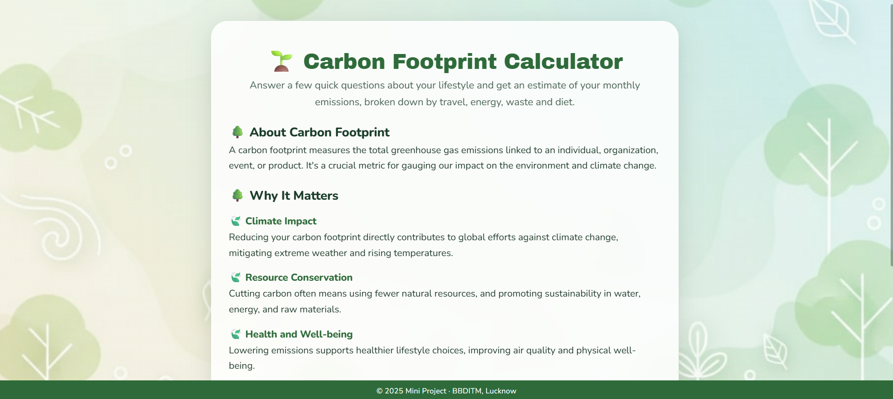
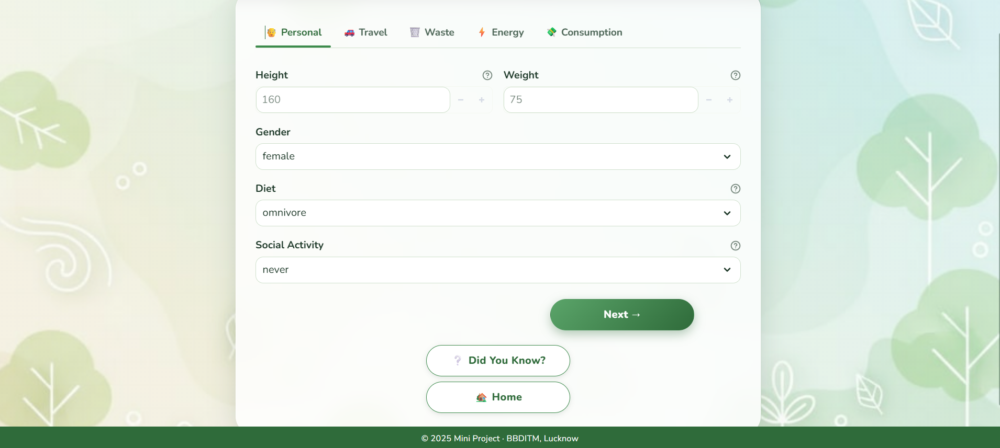
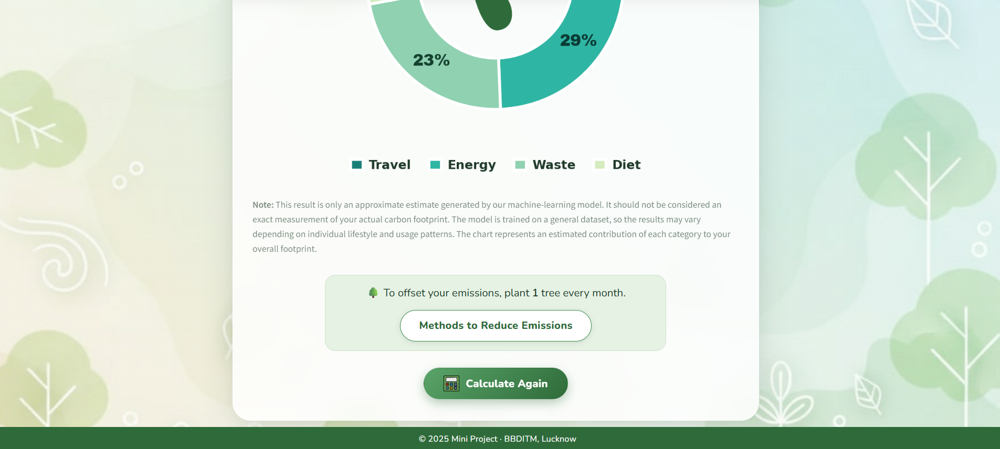
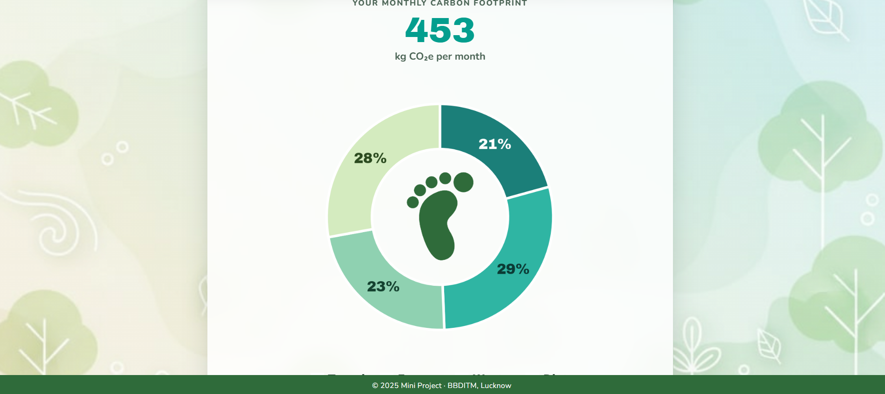

# 🌱 Carbon Footprint Calculator

> **An ML-powered web application that estimates an individual's monthly carbon footprint based on lifestyle, travel, energy, waste, diet, and consumption habits.**

[](https://www.python.org/)
[](https://streamlit.io/)
[]
[]


---

## 🚀 Live Demo 

### 🌐 Try the Application

**Live Demo:** [(https://carbon-footprint-calculator-eqng.onrender.com)]


---

## 📌 About The Project

The **Carbon Footprint Calculator** is a machine-learning based web application developed as a college project to provide users with an approximate estimate of their monthly carbon footprint.

Instead of using only fixed calculations, the application takes multiple lifestyle-related inputs and uses a trained ML model to generate an estimated footprint.

The goal of the project is to make carbon-footprint estimation **simple, interactive, and easy to understand** for everyday users.

### 🎯 What does it consider?

The application collects information related to:

* 👤 Personal lifestyle
* 🚗 Transportation
* ✈️ Air travel
* 🗑️ Waste generation and recycling
* ⚡ Household energy usage
* 🍽️ Diet and food-related habits
* 👕 Consumption habits
* 💻 PC, TV and internet usage
* 🚿 Shower frequency
* 💰 Monthly grocery spending

The final result is displayed as an estimated **monthly CO₂e footprint**, along with an approximate category-wise breakdown.

---

## 🖥️ Application Preview

### 🏠 Home / Introduction



The landing page introduces the purpose of the calculator and guides the user towards entering their lifestyle information.

---

### 📝 Lifestyle Information



Users provide information about their personal habits, transportation preferences, vehicle usage and air travel.

---


### 📊 Carbon Footprint Result




After completing the form, the application generates an estimated monthly footprint and displays an approximate contribution of different categories such as:

* 🚗 Travel
* ⚡ Energy
* 🗑️ Waste
* 🍽️ Diet

---

## 🧠 Machine Learning Approach

The application uses a trained **machine-learning regression model** to estimate the carbon footprint from the user's lifestyle inputs.

### Basic workflow

```text
User Input
    ↓
Data Preprocessing
    ↓
Feature Encoding
    ↓
Feature Scaling
    ↓
Trained ML Model
    ↓
Carbon Footprint Prediction
    ↓
Category-wise Breakdown
    ↓
Interactive Result
```

The project includes a saved model and scaler inside the `models/` directory.

```text
models/
├── model.sav
└── scale.sav
```

The application loads these trained components and uses them to generate predictions from the user's input.

---

## 🛠️ Tech Stack

| Technology      | Purpose                         |
| --------------- | ------------------------------- |
| 🐍 Python       | Core programming language       |
| 🎈 Streamlit    | Web application interface       |
| 🤖 Scikit-learn | Machine learning model          |
| 🐼 Pandas       | Data processing                 |
| 🔢 NumPy        | Numerical operations            |
| 📊 Matplotlib   | Result visualization            |
| 🎨 HTML/CSS     | Custom UI styling               |
| ⚡ JavaScript    | Interactive UI behaviour        |
| 💾 Pickle       | Saving/loading trained ML model |

---

## ✨ Key Features

### 👤 Personal Profile

Collects basic lifestyle information such as:

* Gender
* Diet
* Body type
* Social activity
* Shower frequency

### 🚗 Transportation

Users can provide:

* Preferred transportation method
* Vehicle type
* Monthly vehicle distance
* Air-travel frequency

### 🗑️ Waste & Recycling

The application considers:

* Waste bag size
* Weekly waste generation
* Recycling habits
* Materials being recycled

### ⚡ Energy Usage

Inputs include:

* Heating energy source
* Cooking appliances
* Energy-efficiency habits
* Daily PC/TV usage
* Daily internet usage

### 🛍️ Consumption

The calculator also considers:

* Monthly grocery spending
* Monthly clothing purchases

### 📊 Visual Results

The application provides:

* Monthly estimated CO₂e
* Category-wise emission breakdown
* Interactive and visually focused result page
* Approximate tree-offset suggestion

---

## 📈 Example Output

The final result is presented in the following format:

```text
Your monthly carbon footprint

XXXX kg CO₂e / month
```

Along with a visual breakdown:

```text
          Travel
        ┌─────────┐
        │         │
   Diet │  RESULT │ Energy
        │         │
        └─────────┘
          Waste
```

> The values shown by the application are **model-based estimates**, not direct measurements.

---

## ⚠️ Important Note About Accuracy

This project is intended primarily as a **college-level machine-learning project and educational tool**.

The generated footprint should **not be treated as an exact measurement** of an individual's actual carbon emissions.

The model is trained using a general dataset and does not specifically represent every lifestyle, region, or household pattern. Therefore, actual emissions may differ from the application's estimate.

The category chart should also be understood as an **approximate model-based contribution**, rather than a scientifically verified emissions audit.

---

## 📂 Project Structure

```text
Carbon Footprint Calculator/
│
├── app.py
├── functions.py
├── requirements.txt
│
├── models/
│   ├── model.sav
│   └── scale.sav
│
├── media/
│   ├── background_min.jpg
│   ├── favicon.ico
│   ├── icon2.png
│   ├── icon3.png
│   ├── ayak.png
│   └── default.png
│
├── style/
│   ├── style.css
│   ├── scripts.js
│   ├── main.md
│   ├── footer.html
│   └── ArchivoBlack-Regular.ttf
│
├── .streamlit/
│   └── config.toml
│
├── run_windows.bat
├── run_mac_linux.sh
└── README.md
```

---

# ⚙️ Installation & Setup

## 1️⃣ Clone the Repository

```bash
git https://github.com/abhishekyadav77/Carbon-Footprint-Calculator
cd "Carbon Footprint Calculator"
```

---

## 2️⃣ Python Version

This project works with:

```text
Python 3.10
Python 3.11
Python 3.12
```

> ⚠️ Python 3.13+ is not recommended for this project because some dependencies may not be compatible.

---

## 3️⃣ Create Virtual Environment

### Windows

```bash
python -m venv venv
venv\Scripts\activate
```

### macOS / Linux

```bash
python3 -m venv venv
source venv/bin/activate
```

---

## 4️⃣ Install Dependencies

```bash
pip install -r requirements.txt
```

---

## 5️⃣ Run The Application

```bash
streamlit run app.py
```

The application should open at:

```text
http://localhost:8501
```

---


These scripts automate the environment setup and application launch.

---

# 🎨 UI & Design

The application uses a custom-designed interface rather than Streamlit's default appearance.

### Design includes:

* Custom CSS styling
* Responsive layout
* Custom background graphics
* Custom typography
* Interactive tabs
* Navigation buttons
* Custom result cards
* Donut-chart visualization
* Responsive category breakdown

The main theme can be modified from:

```text
.streamlit/config.toml
```

and:

```text
style/style.css
```

---

# 🌐 Browser Compatibility

The interface uses modern CSS features including the `:has()` selector.

Recommended browsers:

* Google Chrome 105+
* Safari 15.4+
* Firefox 121+

The application also falls back to system fonts when Google Fonts are unavailable.

---

# 🔮 Future Improvements

Some improvements that could be added in future versions:

* 🇮🇳 Training the model specifically on Indian lifestyle and consumption patterns
* 📍 Location-based emission factors
* 📅 Daily / monthly / yearly footprint tracking
* 👥 User accounts and personal history
* 📈 Historical footprint dashboard
* 💡 Personalized suggestions for reducing emissions
* 🌍 More detailed regional emission factors
* 📱 Better mobile optimization
* ☁️ Database integration for storing user results
* 🧠 Experimenting with different ML algorithms
* 📊 More detailed category-level analytics

---

# 🎓 Project Purpose

This project was developed as a **college machine-learning project** to explore how machine learning can be applied to a real-world environmental problem.

It combines:

```text
Machine Learning
      +
Data Preprocessing
      +
Python
      +
Streamlit
      +
Data Visualization
      =
Carbon Footprint Calculator
```

The project also helped in understanding practical concepts such as:

* Feature preprocessing
* Categorical encoding
* Feature scaling
* Model prediction
* Model serialization
* Data visualization
* Streamlit application development
* Custom frontend styling

---

# 👨‍💻 Developer

### Abhishek Kumar Yadav

**B.Tech CSE | Web Developer**

* GitHub: `https://github.com/abhishekyadav77/Carbon-Footprint-Calculator`
* LinkedIn: `https://www.linkedin.com/in/abhishek-yadav-mzp/`

---

# ⭐ Support

If you found this project interesting, consider giving the repository a ⭐ on GitHub.

---


> 🌱 **Small lifestyle changes can contribute to a larger environmental impact.**
>
> *This project is an educational ML-based estimation tool and should not be used as an official carbon accounting system.*
